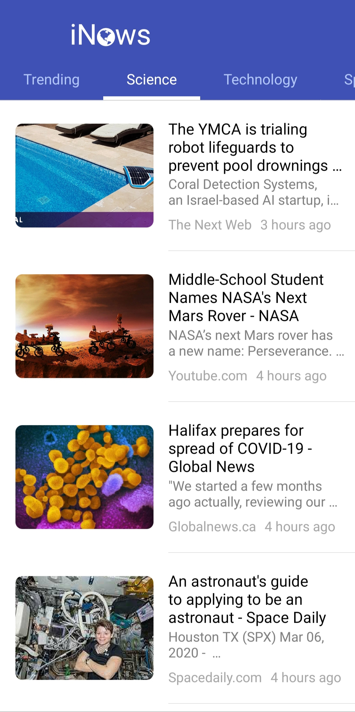
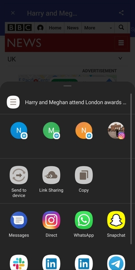

# iNews

## A cross platform app to read the latest news and share them with your friends.
### Built on React-Native, News API, and React modules such as Moment for time management, and Native-Base for a smooth user interface

## Walthrough Video link:
https://drive.google.com/open?id=1Sz8Gp4ycf8cRGFVfGoNf3PD09XZ9HQiR

### Screenshots:

### Tab 1 & Tab 2 
  

### On touching article & On touching the share button
 

You can now share any article with your friends using OS's share system. The recipient will recieve a custom message that shows them the article and message ends with "Shared via INews"

# Requirements
* Requirements
* NodeJS
* Expo

# Installation Guide

1. git clone https://github.com/Kasra-N/PassionProject.git
2. cd iNews
3. npm install / yarn install
4. npm start / yarn start

